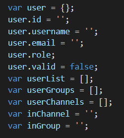
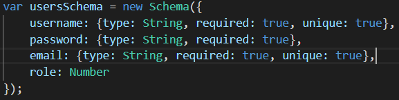
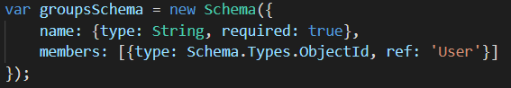
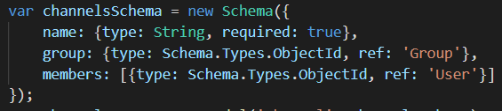
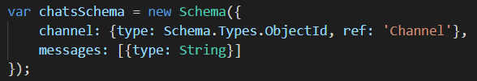

# ChatSystem
Assignment 2 for 3813ICT - Software Frameworks  
A continuation of Assignment 1.  
This project was generated with [Angular CLI](https://github.com/angular/angular-cli) version 8.2.0.

# Table of Contents

| Section | Content |
| --- | --- |
| 01 | Coninuing From Assignment 1 |
| 02 | Git |
| 03 | Data Structure |
| 04 | Angular Architecture & State Change |
| 05 | REST API |

# 01 - Continuing From Assignment 1
As stated above, this is a continuation from Assignment 1, as such, much of this documentation has remained the same. The key difference bewteen this assignment and it's first iteration is the method of data storage. In Assignment 1, data was stored within a JSON file, in this iteration, the JSON file has been superseded by a Mongo database. I have chosen to use MongooseJS, which is an object modeling library for MongoDB, for communicating with the database. This iteration also brings new functionality, the chat system has now been implemented and users are able to join the chat room of a channel and message other users within that channel's chat.

# 02 - Git
Github was used for this project primarily as a means of data backup. There was only one branch used, the Master and files were pushed onto it daily. As this was a solo project I did not feel anything else was needed.

# 03 - Data Structure
This project utilises all kinds of data structures to function properly. Primarily strings and arrays are used, though there are a few instances of integers, booleans and objects. Strings are used to hold the majority of values passed between the front and back ends of the application. These strings are then usually collated into an array for longer storage within the application and iterated through for display. Objects are used primaryly for user data and finally for storing all data used in the application, this object is created initially by reading and taking the contents of the Mongo DB and manipulated through the running of the application. Integers are only used in one instance, user roles are stored as an integer to allow for easier control over functions (ie. a user must have a role of 2 or higher to create a new user). The roles are assigned as follows; 3 = Super Admin, 2 = Group Admin, 1 = Group Assist and 0 = General User. There are only two instances of booleans within the application, they are for storing the value of whether or not a user is valid when after logging in and if a user has entered a chat. When chat is entered, two more arrays are used, one for holding all messages that are sent within the chat feed, the other is only used on entry to the chat, which holds the chat history for that channel's chat. Below is a screenshot of the main data structures used throughout the app.  
 
The following are screenshots of the data structures of each of the MongoDB collections, called document schemas in MongooseJS. 
 
 
 
 

# 04 - Angular Architecture & State Change
The project relys on three parts to function, the front-end (angular), the back-end (node.js server) and the middleware for communicating data between the two, this project utilises Socket.IO to do this. Communication through Socket.IO is used conistantly throughout the application which is housed within four different components, these components have been implemented and carry data between themseleves and the server, these are; Login, App, Dashboard and Chat. The Login route, as the name suggests, handles the user logging in functionality, it sends the user's username and password to the server where it is matched to an existing user read from the Mongo DB and then returns the user's details (username, email and role) along with an added "valid" parameter which dictates if the user is then sent to the dashboard or alerted to being a non-existant user.

App serves as a toolbar for the application, allowing a user to logout, join groups and channels they have access to and enter/leave chat, with its contents only displayed after a successful login, its content remains available until the user has logged out. It is Within this and Dashboard that the vast majority of data is sent back and forth between the server. On a successful login, the server will send an array of groups the user has access to to App, allowing them to select one to join. Once a group has been selected and joined, that groups name is sent to the server and an array of channels the user has been invited to within that group is returned and displayed within App. Channel has a similar setup, though once a channel has been select, the user can then enter the chat for that channel which allows the user to send messages to the feed that other user's in the same channel's chat feed can see. Finally, when a user logs out, they are returned to Login and App is wiped blank.

Dashboard, like App is only accessible after a successful login, when this occurs, Dashboard is sent the same group array as App, along with an array of all usernames, this is for user deletion, alteration and inviting to/removing from groups and channels. Dashboard serves as the hub where a user can create, edit and delete users based on their role, create and delete groups and channels that they have access to along with add and remove users, also based on their role. Anytime one of these functionalities is used, the relevant data is sent to the server where the Mongo DB is updated and then all relevent data is returned to update all necessary fields in both App and Dashboard. For example, of a ne user is created, that user's username will appear in the list of users that can be invited to the current group, if that user is then invited, their name will appear then appear in the list of users to be removed from that gorup.

# 05 - REST API
Within the application data is communicated through routes, each route is listend for by Socket.io and when a route is called, the designated function is used. Below is a table listing all routes used, a psudo code of the attached functionality and if any exist, input parameters and return values. It should be noted that the vast majority of the functionality works off of several global varibales, these global variables are; user, an object containing data of the current user, userList, which is an array of all users, userGroups, an array of groups the user has access to, userChannels, an array of channels the user has access to, inGroup, a string of the name of the current group as user is in and inChannel, another string with the name of the current channel a user is in.

| Route | Parameters | Description | Return Values |
| --- | --- | --- | --- |
| update |   | Empty userList, iterate through stored users and adding usernames to userList, emit getUsers. Empties, userGroups and all Groups, iterates through stored groups, adding group name to allGroups, if username is in group, add group name to userGroups, emit userGroups and allGroups. If inGroup is true, empty userChannels, iterate through stored channels, if username in channel, add channel name to userChannels, emit userChannels. | 
| login | username, password, callback function (res) | Empties userGroups, allGroups and userList arrays, iterate through users stored in Mongo DB, compare username and password parameters to stored users username and password. If matched, add stored user data to user object with a valid parameter of true and emit userLoggedIn route. Iterate through all stored groups, add each group name to allGroups, check if current username in group, if so, add group name to userGroups array. Emit allGroups, userGroups and getUsers. | user |
| logout |  | Clears user data. |
| getChannels | groupList | Emit groupJoined, inGroup becomes groupList, empty userChannels and usersInGroup, iterate through stored groups, if stored groups name is groupList, add all members to usersInGroup. Iterate through all channels, if channel is in group groupList, if users name in channels members, add channel name to userChannels. Emit getUsersInGroup, groupJoined and userChannels. |
| joinChannel | channel | inChannel becomes channel, empty usersInChannel, iterate through all stored channels, if schannel name is inChannel and stored channel group is inGroup, usersInChannel becomes stored channels members. Emit getUsersInChannel and channelJoined. |
| createUser | username, password, email, role | Initiate object called user with username, password, email and role, write object to db. |
| editUser | userToEdit, updatedRole | Search DB for userToEdit, update role to updatedRole. |
| deleteUser | userToDelete | Find and removes userToDelete from user's schema, returns user's id, removes all occurances of it from groups and channels schemas. |
| createGroup | groupName | Initiate newGroup object with groupName and username, store object in DB. |
| deleteGroup | groupName | Find and removes groupName from groups schema, returns group's id, finds all channels with that id in group and removes them. |
| inviteToGroup | groupName, user | Iterate through stored groups, if stored groups name is groupName, check if user is in groups members, if they are dont do anything else, if not, push user to stored groups members. Write stored data to file. Empty usersInGroup, iterate through stored groups, if stored groups name is inGroup, usersInGroup becomes stored groups members. Emit getUsersInGroup |
| removeFromGroup | groupName, user | Iterate through stored groups, if stored groups name is groupName, iterate through stored groups members, if user is in stored groups members, remove it. Write stored data to file. Empty usersInGroup, iterate through stored groups, if stored groups name is groupName, usersInGroup becomes stored groups members. Emit getUsersInGroup. |
| createChannel | channelName, group | Initiate newChannel object with channelName, group and username, add newChannel to stored channels. Write stored data to file. |
| removeChannel | channelName | Iterate though stored channels, if stored channels name is channelName, remove it. Write stored data to file. |
| inviteToChannel | channelName, user | Iterate through stored channels, if stored channel name os channelName, check if stored channel members includes user, if it does, don't continue, if it doesn't, add user to stored channels members. Write stored data to file. Empty usersInChannel, iterate through stored channels, if stored channels name is inChannel, stored channels members becomes usersInChannel. Emit getUsersInChannel. |
| removeFromChannel | channelName, user | Iterate through stored channels, if stored channels name is channelName, iterate through stored channels members, if user is in stored channels members, remove it. Write stored data to file. Empty usersInChannel, iterate through stored channels, if stored channels name is inChannel, usersInChannel becomes stored channels members. Emit getUsersInChannel. |
| chatJoined | channel | Initiate empty array for chat history and empty string for current channel's id, find channel's id in db and assign it to string variable. Trys to find chat history of channel, if found, puts messages in array, if not, does nothing. Sets the namespace room for socket to channel, emits chatHistory and then message in the room that current user has joined the chat. |
| chatHistory | chatHistory | Passes chatHistory for chat to add it to messages. |
| leftChat | channel | Emits a message in that room that current user has left the chat and clears the socket namespace room |
| message | message | Initiate empty string for current channel's id, find channel's id in db and assign it to string variable. Trys to find chat history of channel, if found, appends message to messages array, if not, creates new db chat document, with channel's id and message. Emits message to current channel socket namespace room. |
